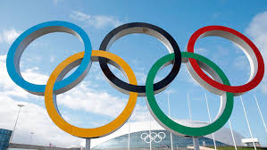

# SQL_120-years-of-Olympics-History
## Olympic Games Data Analysis

This README provides an overview of SQL queries used for analyzing a comprehensive dataset of Olympic Games spanning 120 years. The queries are written using SQL Server Management Studio (SSMS) and are designed to extract meaningful insights regarding participation, medal counts, and athlete information.

## Purpose

The goal of this analysis is to gain insights into the Olympic Games by:
- Understanding the number of games held and their details.
- Analyzing participation by countries and sports.
- Identifying trends in medal wins by athletes and countries.
- Exploring specific aspects related to India’s performance and other unique queries.

## List of Queries

### 1. **Total Number of Olympic Games Held**
   - **Description:** Counts the total number of distinct Olympic Games that have been held.
   - **Objective:** Determine the scope of the dataset.

### 2. **List of All Olympic Games Held**
   - **Description:** Retrieves a complete list of all unique Olympic Games.
   - **Objective:** Provide an overview of all Olympic events.

### 3. **Total Number of Nations Participating in Each Olympic Game**
   - **Description:** Counts the number of distinct nations that participated in each Olympic Games.
   - **Objective:** Assess the participation level of different nations in each Olympic event.

### 4. **Years with Highest and Lowest Number of Participating Countries**
   - **Description:** Identifies the years with the maximum and minimum number of participating countries.
   - **Objective:** Understand trends in global participation over time.

### 5. **Nations Participating in All Olympic Games**
   - **Description:** Finds nations that have participated in every Olympic Games.
   - **Objective:** Identify countries with consistent participation across all events.

### 6. **Sports Played in All Summer Olympics**
   - **Description:** Determines which sports have been included in every Summer Olympic Games.
   - **Objective:** Highlight sports with a continuous presence in Summer Olympics.

### 7. **Sports Played Only Once in the Olympics**
   - **Description:** Lists sports that have been featured in only one Olympic Games.
   - **Objective:** Explore unique or rare sports events.

### 8. **Total Number of Sports in Each Olympic Game**
   - **Description:** Counts the number of different sports played in each Olympic Games.
   - **Objective:** Assess the variety of sports featured in each Olympic event.

### 9. **Oldest Athletes to Win a Gold Medal**
   - **Description:** Retrieves details of the oldest athletes who have won a gold medal.
   - **Objective:** Recognize exceptional achievements in Olympic history.

### 10. **Ratio of Male to Female Athletes Across All Olympic Games**
   - **Description:** Calculates the ratio of male to female athletes participating in the Olympics.
   - **Objective:** Analyze gender representation in the Olympics.

### 11. **Top 5 Athletes with Most Gold Medals**
   - **Description:** Lists the top 5 athletes with the highest number of gold medals.
   - **Objective:** Identify the most successful gold medalists.

### 12. **Top 5 Athletes with Most Total Medals**
   - **Description:** Retrieves the top 5 athletes with the most total medals (gold, silver, and bronze).
   - **Objective:** Highlight the most decorated athletes.

### 13. **Top 5 Most Successful Countries in the Olympics**
   - **Description:** Lists the top 5 countries based on the total number of medals won.
   - **Objective:** Determine the most successful countries in Olympic history.

### 14. **Total Gold, Silver, and Bronze Medals Won by Each Country**
   - **Description:** Shows the total number of gold, silver, and bronze medals won by each country.
   - **Objective:** Provide a detailed breakdown of medal wins by country.

### 15. **Medals Won by Each Country in Each Olympic Game**
   - **Description:** Lists the total number of gold, silver, and bronze medals won by each country for each Olympic Games.
   - **Objective:** Analyze medal performance by country for each specific event.

### 16. **Country with Most Gold, Silver, and Bronze Medals in Each Olympic Game**
   - **Description:** Identifies the country with the highest number of gold, silver, and bronze medals in each Olympic Games.
   - **Objective:** Determine the leading country for each type of medal in individual Olympic events.

### 17. **Country with Most Gold, Silver, Bronze Medals, and Total Medals in Each Olympic Game**
   - **Description:** Identifies the country with the highest number of gold, silver, bronze medals, and total medals in each Olympic Games.
   - **Objective:** Provide a comprehensive view of medal success by country.

### 18. **Countries Never Winning Gold but Winning Silver/Bronze**
   - **Description:** Finds countries that have won silver or bronze medals but have never won a gold medal.
   - **Objective:** Highlight countries with notable achievements without gold medals.

### 19. **Sport/Event Where India Won the Highest Number of Medals**
   - **Description:** Identifies the sport or event where India has achieved the highest number of medals.
   - **Objective:** Examine India’s strongest performance areas.

### 20. **Breakdown of All Olympic Games Where India Won Medals for Hockey**
   - **Description:** Lists the Olympic Games where India won medals in Hockey and provides the count of medals won in each of those Games.
   - **Objective:** Detail India’s achievements in Hockey across different Olympic events.

## Notes

- All queries are executed using SQL Server Management Studio (SSMS).
- The dataset spans 120 years of Olympic Games, providing a rich historical context for analysis.
- Ensure that your SQL environment is set up to handle the dataset and queries efficiently.

Feel free to modify or expand upon this README as needed for your project.
